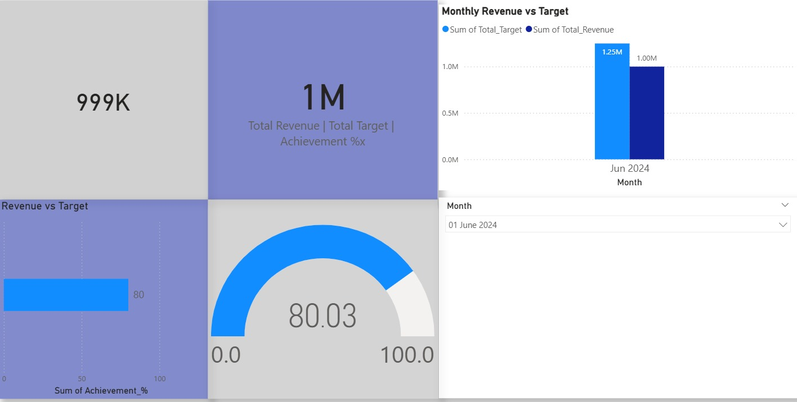

# 📊 Finance Dashboard (Power BI)

## 📌 Project Objective
This project focuses on analyzing financial data and tracking key performance indicators (KPIs) using an interactive Power BI dashboard.

---

## 📊 Problem Statement
Businesses need to monitor:
- Revenue and expenses
- Monthly performance trends
- Key financial KPIs

This dashboard helps in making data-driven financial decisions.

---

## 📁 Dataset
- Financial cleaned dataset (CSV)
- Monthly KPI dataset

---

## ⚙️ Tools Used
- Power BI
- Excel / CSV
- Data Cleaning
- DAX

---

## 📈 Key Insights
- 💰 Revenue vs Expenses comparison  
- 📅 Monthly trends analysis  
- 📊 KPI tracking for financial performance  
- 📉 Profitability insights  

---

## 📷 Dashboard Preview

---

## 🚀 How to Use
1. Download the `.pbix` file  
2. Open in Power BI Desktop  
3. Explore dashboard  

---

## 💡 Skills Demonstrated
- Data Analysis  
- KPI Tracking  
- Dashboard Design  
- Business Insights  

---

## 👤 Author
Jeetendra
